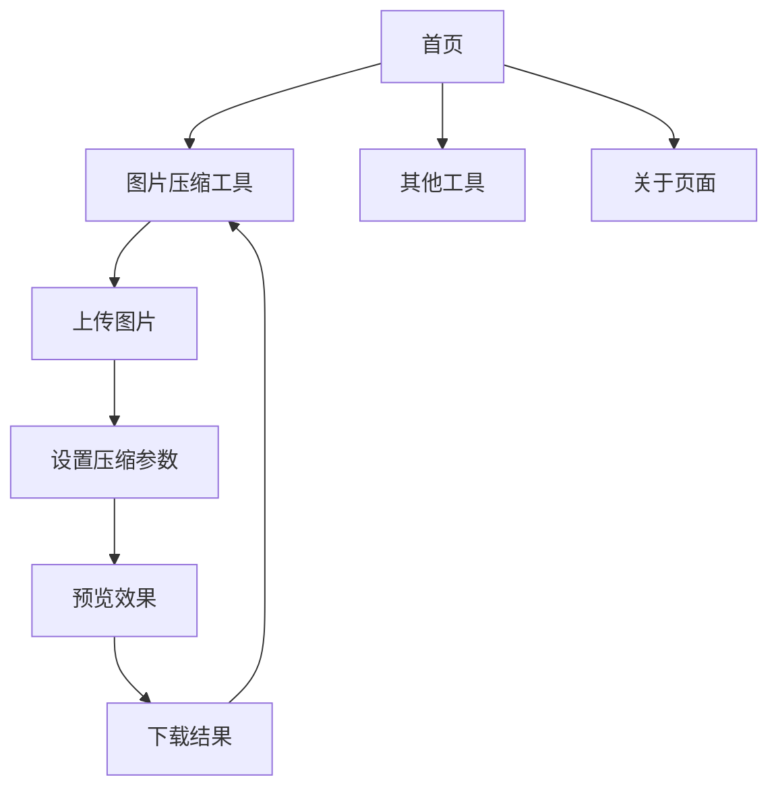

## 1. 产品概述
一个基于Vue3+Vite+TypeScript+ElementPlus的纯前端工具网站框架，提供美观的界面和暗夜模式切换功能。以图片压缩工具作为示例，展示框架的完整功能。

该框架旨在为开发者提供一个现代化的工具网站模板，可以快速扩展和添加各种前端工具功能。

## 2. 核心功能

### 2.1 用户角色
本工具网站为匿名访问，无需用户注册登录即可使用所有功能。

### 2.2 功能模块
网站包含以下核心页面：
1. **首页**：工具列表展示、导航菜单、主题切换
2. **图片压缩工具页**：图片上传、压缩设置、下载功能
3. **关于页面**：工具介绍、使用说明

### 2.3 页面详情
| 页面名称 | 模块名称 | 功能描述 |
|---------|---------|---------|
| 首页 | 导航菜单 | 展示网站Logo，包含工具分类菜单，支持响应式折叠 |
| 首页 | 主题切换 | 暗夜/日间模式切换按钮，记住用户偏好设置 |
| 首页 | 工具卡片 | 展示各个工具的图标、名称和简要描述 |
| 图片压缩工具 | 文件上传 | 支持拖拽上传和点击上传，限制文件大小和格式 |
| 图片压缩工具 | 压缩设置 | 调整压缩质量、输出格式选择 |
| 图片压缩工具 | 预览对比 | 显示原图和压缩后的对比效果 |
| 图片压缩工具 | 下载功能 | 一键下载压缩后的图片文件 |
| 关于页面 | 工具介绍 | 说明工具的功能特点和使用场景 |
| 关于页面 | 使用教程 | 详细的操作步骤和注意事项 |

## 3. 核心流程
用户访问网站的主要流程：
1. 用户进入首页，可以看到所有工具的卡片展示
2. 点击具体工具（如图片压缩）进入工具页面
3. 在工具页面完成相应操作（上传图片、设置参数、下载结果）
4. 可随时通过导航菜单切换不同工具或返回首页

## 4. 用户界面设计

### 4.1 设计风格
- **主色调**：日间模式使用ElementPlus默认蓝色系，暗夜模式采用深灰色调
- **按钮样式**：圆角矩形设计，悬停效果明显，点击反馈清晰
- **字体选择**：优先使用系统默认字体，确保加载速度
- **布局风格**：卡片式布局，顶部导航栏固定，内容区域自适应
- **图标风格**：使用ElementPlus内置图标，保持风格统一

### 4.2 页面设计概览
| 页面名称 | 模块名称 | UI元素 |
|---------|---------|--------|
| 首页 | 导航栏 | 左侧Logo，中间菜单项，右侧主题切换按钮，背景毛玻璃效果 |
| 首页 | 工具卡片 | 网格布局，每张卡片包含图标、标题、描述，悬停时有阴影加深效果 |
| 图片压缩工具 | 上传区域 | 大虚线框表示拖拽区域，中央有上传图标和文字提示 |
| 图片压缩工具 | 设置面板 | 滑块控制压缩质量，下拉选择输出格式，实时显示文件大小 |
| 图片压缩工具 | 预览区域 | 左右分栏显示原图和压缩图，显示压缩比例和节省空间 |

### 4.3 响应式设计
- **桌面优先**：默认适配1920px宽度，内容最大宽度1200px居中显示
- **移动端适配**：768px以下切换为移动端布局，导航菜单变为汉堡菜单
- **触摸优化**：按钮和交互元素增大点击区域，适合触摸操作

### 4.4 暗夜模式细节
- 背景色：#1a1a1a 到 #2d2d2d 的渐变
- 文字颜色：主要文字 #ffffff，次要文字 #b3b3b3
- 卡片背景：#363636 带轻微透明度
- 边框颜色：#4d4d4d
- 切换动画：平滑的过渡效果，持续300ms