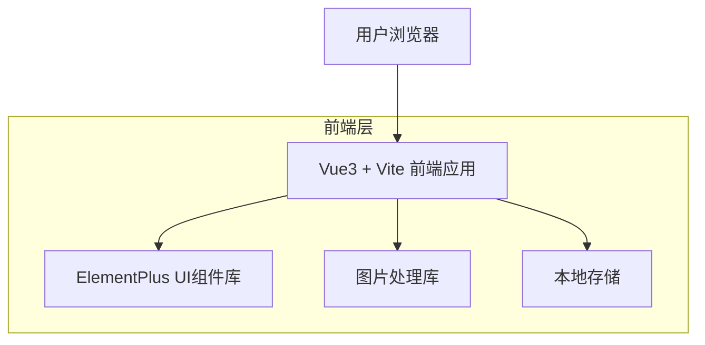

## 1. 架构设计



## 2. 技术描述

- **前端框架**: Vue3@3.3 + TypeScript@5 + Vite@4
- **UI组件库**: ElementPlus@2.4
- **初始化工具**: vite-init
- **CSS框架**: TailwindCSS@3.3（可选，用于自定义样式）
- **图标库**: ElementPlus内置图标
- **图片处理**: browser-image-compression@2.0
- **状态管理**: Vue3 Composition API + provide/inject
- **路由**: Vue Router@4

## 3. 路由定义

| 路由路径 | 页面用途 |
|---------|---------|
| / | 首页，展示工具列表 |
| /tools/image-compression | 图片压缩工具页面 |
| /about | 关于页面，工具说明 |
| /settings | 设置页面（预留） |

## 4. 核心组件结构

### 4.1 主要组件
```typescript
// 主应用组件
App.vue
├── HeaderNav.vue          // 顶部导航栏
├── ThemeToggle.vue        // 主题切换按钮
├── ToolCard.vue          // 工具卡片组件
└── ImageCompressor.vue   // 图片压缩工具主组件
    ├── FileUpload.vue    // 文件上传组件
    ├── CompressionSettings.vue  // 压缩设置组件
    ├── ImagePreview.vue  // 图片预览组件
    └── DownloadButton.vue // 下载按钮组件
```

### 4.2 工具接口定义
```typescript
// 工具接口定义
interface Tool {
  id: string;
  name: string;
  description: string;
  icon: string;
  route: string;
  category: string;
}

// 图片压缩配置
interface CompressionOptions {
  quality: number;      // 压缩质量 0-1
  maxWidth: number;     // 最大宽度
  maxHeight: number;    // 最大高度
  outputFormat: 'jpeg' | 'png' | 'webp';
  preserveExif: boolean; // 是否保留EXIF信息
}

// 压缩结果
interface CompressionResult {
  originalFile: File;
  compressedFile: File;
  originalSize: number;
  compressedSize: number;
  compressionRatio: number;
}
```

### 4.3 主题管理
```typescript
// 主题类型
type Theme = 'light' | 'dark';

// 主题配置
interface ThemeConfig {
  primary: string;
  background: string;
  text: string;
  cardBg: string;
  border: string;
}
```

## 5. 状态管理架构

```mermaid
graph TD
    A[App.vue] --> B[useTheme()]
    A --> C[useTools()]
    C --> D[ImageCompressor.vue]
    D --> E[useImageCompression()]
    
    subgraph "Composition API"
        B
        C
        E
    end
```

## 6. 工具数据结构

### 6.1 工具列表数据
```typescript
// 工具列表数据
const tools: Tool[] = [
  {
    id: 'image-compression',
    name: '图片压缩',
    description: '在线压缩图片文件大小，支持多种格式',
    icon: 'Picture',
    route: '/tools/image-compression',
    category: '图片处理'
  },
  {
    id: 'json-formatter',
    name: 'JSON格式化',
    description: '美化和验证JSON数据格式',
    icon: 'Document',
    route: '/tools/json-formatter',
    category: '开发工具'
  },
  {
    id: 'color-picker',
    name: '颜色选择器',
    description: '选择颜色并获取对应的色值',
    icon: 'Magic',
    route: '/tools/color-picker',
    category: '设计工具'
  }
];
```

### 6.2 本地存储结构
```typescript
// 用户偏好设置
interface UserPreferences {
  theme: Theme;
  recentTools: string[];
  compressionSettings: CompressionOptions;
}

// 存储键名
const STORAGE_KEYS = {
  THEME: 'tool-website-theme',
  RECENT_TOOLS: 'tool-website-recent-tools',
  COMPRESSION_SETTINGS: 'tool-website-compression-settings'
} as const;
```

## 7. 性能优化策略

### 7.1 代码分割
- 按路由进行代码分割
- 工具组件按需加载
- ElementPlus组件按需引入

### 7.2 图片处理优化
- 使用Web Worker进行图片压缩
- 实现图片预览的懒加载
- 压缩过程显示进度条

### 7.3 缓存策略
- 用户主题偏好本地存储
- 工具设置参数本地缓存
- 压缩结果临时缓存（可配置有效期）

## 8. 浏览器兼容性

- **现代浏览器**: Chrome 88+, Firefox 85+, Safari 14+, Edge 88+
- **ES6+支持**: 使用原生ES模块
- **图片格式支持**: JPEG, PNG, WebP, GIF（读取）
- **文件API**: 支持File API和Blob API